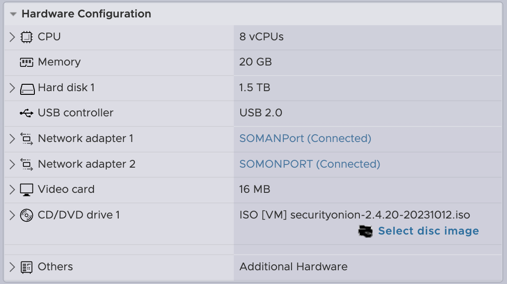
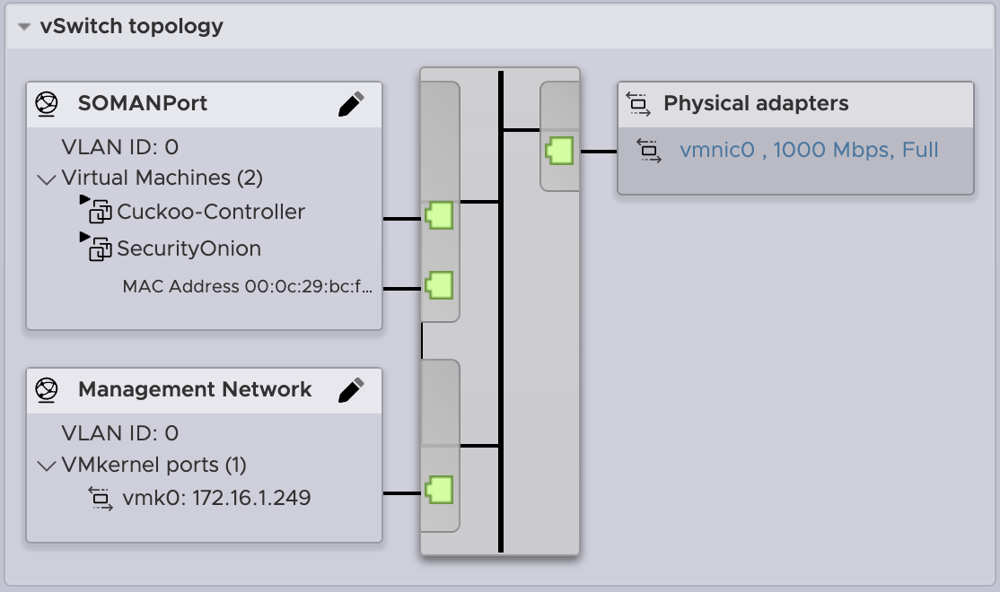
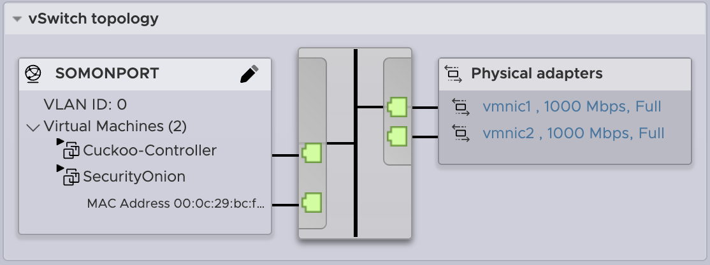
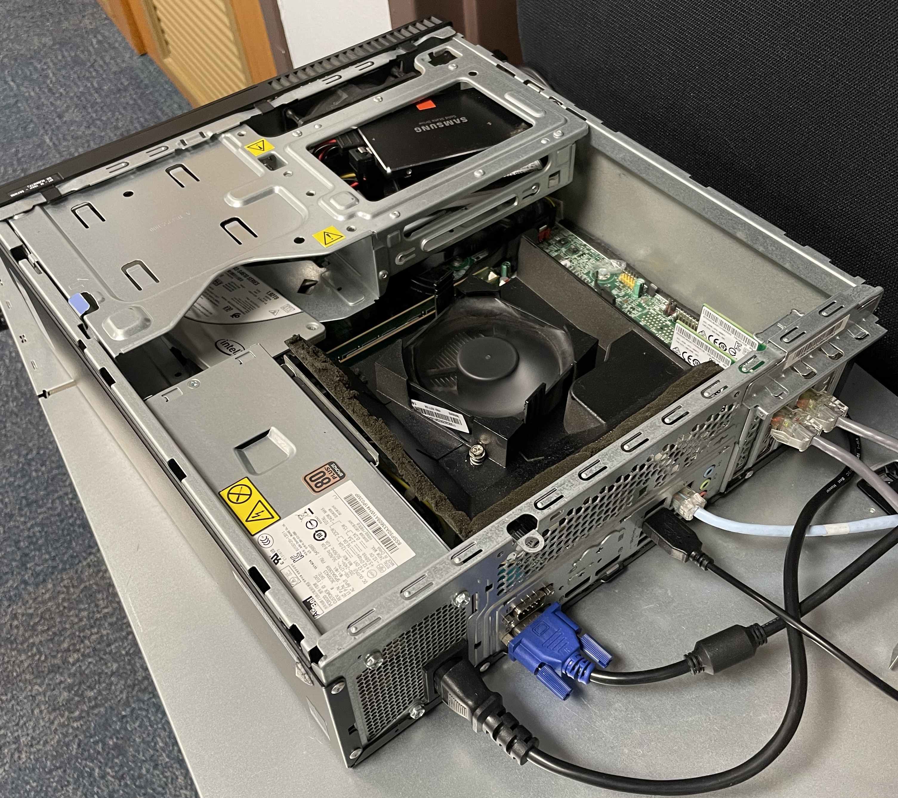
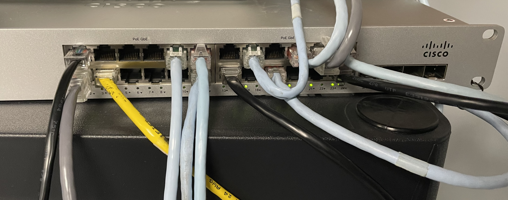

# Security Onion Configuration

## Version
- **Security Onion Version:** 2.4.20
- **Installation Type:** Standalone Installation

## Hardware
- **Operating System:** Oracle Linux 9 (64 bit)
- **Hard Drive:** 1.5 TB
- **CPUs:** 8
- **Memory:** 20 GB
- **Network Interface Cards:** 2
  - One for Management (Web UI)
  - One for Monitoring (traffic from the lab to be monitored)

## Networking

### Management Interface
- Used to access the Web UI and the console via VMware ESXi
- Assigns an IP address to the virtual machine and the ESXi interface

### Monitoring Interface
- Used to ingest all traffic that is mirrored by the physical switch
- Does not assign an IP address
- Operates in Promiscuous Mode to capture all the traffic it sees on the network
- Shown are two physical network interface cards which were used to perform NIC Teaming, an attempt at reducing latency.

## Access

### Student Account
- Allows the user to perform analyses

### Admin Account
- Allows the user to make any necessary changes via the web interface

## Integrations
- **Threat Intelligence:** AbuseCH
  - More than 100 observables are imported an hour

## Physical Hardware Configurations
### Server

This is the server that is hosting Security Onion through a local instance of VMware ESXi. Two network adapters are shown but only one is currently configured to send traffic to Security Onion.

### Lab Switch

This directs the flow of traffic into, out of, and across the network, what is known as north-south and east-west traffic.

