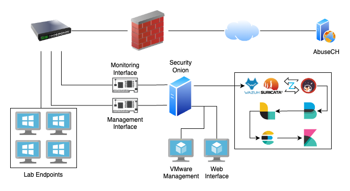

# Intelligence-Driven Network Intrusion Detection - Senior Project

## Overview

This repository documents my senior project, where I implemented a Network Intrusion Detection System (NIDS) using Security Onion in Xavier University's Cyber Defense Lab. The lab comprises 25 physical endpoints, each running multiple VMs.

## Installation Details

- **Security Onion Version:** 2.4.20
- **Deployment:** Physical server connected to a physical switch, controlling east-west and north-south traffic flow.
- **Assistance:** Configured port mirroring with Meraki to direct lab traffic to Security Onion.

## Project Timeline

1. **Preparation:**
    - Installed Security Onion on my personal computer during the summer before the semester.
    - Tested the installation and configuration in a controlled environment.
    - Developed a project proposal and consulted with Xavier faculty.

2. **Lab Deployment:**
    - Set up the NIDS server on a physical server running VMware ESXi, connected to the lab's physical switch.
    - Configured port mirroring with Meraki to direct lab traffic to Security Onion.

3. **Documentation:**
    - Created a network diagram.
    - Maintained a documentation file outlining project details.
    - Published descriptions and instructions for students accessing the interface.

4. **Troubleshooting:**
    - Adequate space was required for traffic logs. A new hard disk drive with more storage was installed and Security Onion was reinstalled on that drive.
    - An abundance of network traffic caused by the consistent use of so many machines necessitated deleting the logs after only a week.
    - Hyper-V was the initial hypervisor but did not provide the necessary networking capabilities to forward logs to Security Onion

5. **Testing:**
    - Used malware-traffic-analysis.net and testmyNIDS to ensure full configuration and success of the project.
    - Refined dashboards, user access, and alerts deemed false positives.

## Additional Resources

- [**Project Evaluation**](./Improvements.md)
- [**Documentation**](./Documentation.md)
- [Network Diagram](./images/Network_Diagram.jpeg)
- [Project Proposal](./Project_Proposal.md)
- [Security Onion Overview Page](./Security_Onion_Overview.md)

## Learning Outcomes

- **SIEM and NIDS Architecture:** configuring components of the Elastic Stack and the network to manage SIEM data
- **Hardware Limitations:** adapting to storage and performance constraints to stabilize the SIEM
- **Virtualization:** choosing VMware ESXi as the foundation for a stable and reliable environment
- **Network Traffic Analysis:** mirroring traffic to apply analysis techniques with Kibana queries and dashboards
- **Documentation:** tracking progress and configurations visually and through open-source write-ups
- **Threat Intelligence:** enhancing the capability of a NIDS to detect threats and inform hunting activities

This project provided a comprehensive understanding of the components required for effective traffic monitoring and deepened my knowledge of threat detection and analysis.

For detailed information, refer to the respective documents in this repository.
