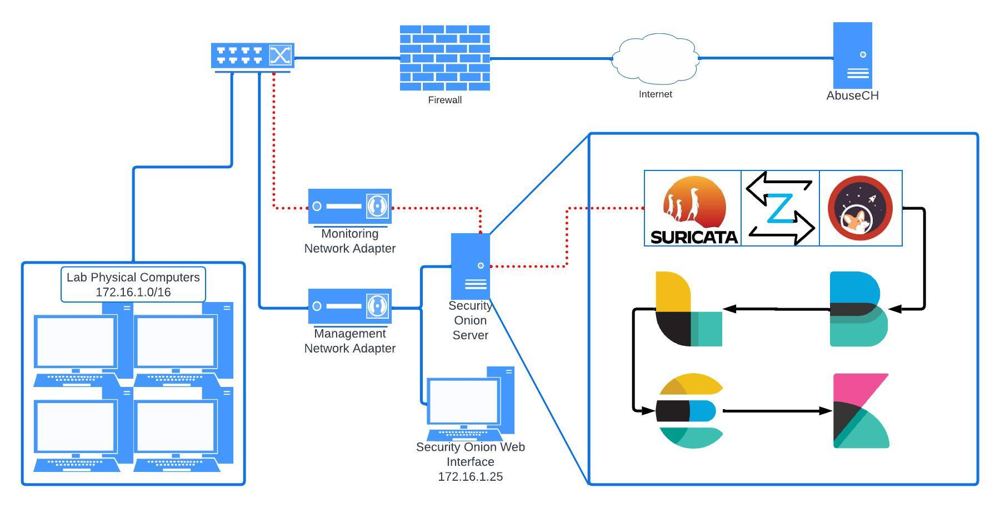

# Network Intrusion Detection System - Senior Project

## Overview

This repository documents my senior project, where I implemented a Network Intrusion Detection System (NIDS) using Security Onion in Xavier University's Cyber Defense Lab. The lab comprises over a dozen machines, each running a Kali VM and two reverse engineering VMs.

## Installation Details

- **Security Onion Version:** 2.4.20
- **Deployment:** Physical server connected to a physical switch, controlling east-west and north-south traffic flow.
- **Assistance:** Configured port mirroring with Meraki to direct lab traffic to Security Onion.

## Project Timeline

1. **Preparation:**
    - Installed Security Onion on my personal computer during the summer before the semester.
    - Tested the installation and configuration in a controlled environment.

2. **Lab Deployment:**
    - Set up the NIDS server on a physical server running VMware ESXi, connected to the lab's physical switch.
    - Configured port mirroring with Meraki to direct lab traffic to Security Onion.

3. **Documentation:**
    - Created a network diagram.
    - Developed a project proposal.
    - Maintained a documentation file outlining project details.

4. **NIC Teaming:**
    - Ensured smooth traffic flow by performing NIC teaming.
    - Added an additional physical network adapter to the ESXi Host (Security Onion).

## Additional Resources

- [Network Diagram](./images/Network_Diagram.jpeg)
- [Project Proposal](./Project_Proposal.md)
- [**Documentation**](./Documentation.md)
- [Security Onion Overview Page](./Security_Onion_Overview.md)
- [NIC Teaming Guide](./NIC_Teaming.md)
- [**Project Evalutation**](./Improvements.md)

## Learning Outcomes

- Gained insights into setting up a SIEM and NIDS.
- Developed proficiency in using Kibana (Security Onion's Discovery and Dashboard windows).
- Performed threat hunting using tools like testmyNIDS to emulate malware downloads.

This project provided a comprehensive understanding of the components required for effective traffic monitoring and deepened my knowledge of threat detection and analysis.

For detailed information, refer to the respective documents in this repository.
